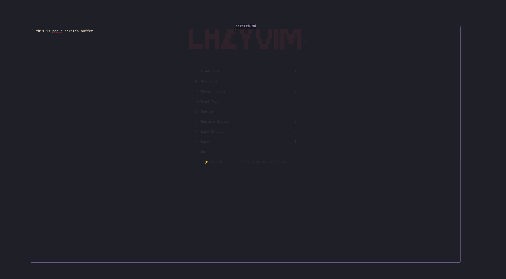

# nvim-scratch

Scratch popup for Neovim.



## Installation

To install this plugin, you can use your favorite Neovim package manager. For example:

### [lazy](https://github.com/folke/lazy.nvim) (recommended)

```lua
{
  "https://github.com/hoangnghiem/nvim-scratch",
  lazy = true,
}
```

## Usage

### Commands

The plugin provides command:

- `:ScratchToggle` — Toggle the scratch popup.

### Lua Functions

You can also use the plugin's Lua functions directly:

- `require('nvim-scratch').toggle_scratch()` — Equivalent to `:ScratchToggle`.

## License

[MIT License](LICENSE)

## Contributing

Contributions are welcome! Feel free to open issues or submit pull requests.
